# Polynomial , Logistic and Multinomial Regression

# Table of Contents

1. [Polynomial Regression](#polynomial-regression)
   - [Dataset Generation](#dataset-generation)
   - [Gradient Descent Algorithm](#gradient-descent-algortihm)
   - [Code Implementation](#code-implementation-polynomial-regression)
     - [Generating Data](#generating-data)
     - [Calculating Gradient](#calculating-gradient-of-polynomial-parameters)
     - [Updating Weight](#updating-weight-parameter-of-polynomial)
     - [Sample Bash Command](#sample-bash-command-to-run-the-polynomial-regression-script)
   - [Results](#polynomial-regression-results)

2. [Logistic Regression](#logistic-regression)
   - [Sigmoid Function](#sigmoid-function)
   - [Logistic Cost Function](#logistic-cost-function)
   - [Gradient Descent on Binary Cross Entropy](#gradient-descent-on-binary-cross-entropy)
   - [Code Implementation](#code-implementation-logistic-regression)
     - [Gradient Descent](#gradient-descent-logistic-regression)
     - [Binary Cross Entropy](#binary-cross-entropy)
     - [Sample Bash Command](#sample-bash-command-to-run-the-logistic-regression-script)
   - [Results](#results-logistic-regression)

3. [Multinomial Logistic Regression](#multinomial-logistic-regression)
   - [Approach Explanation](#approach-explanation)
   - [Code Implementation](#code-implementation-multinomial-logistic-regression)
     - [Predicting Class](#predicting-class)
     - [Calculating Loss](#calculating-loss)
     - [Sample Bash Command](#sample-bash-command-to-run-the-multiinomial-script)
   - [Results](#results-multinomial-regression)

 

## Polynomial Regression 

In this task I will be doing 2nd order polynomial fitting using gradient descent algorithm.  
This is the function that I will be doing fitting on $`Ax^2 +Bx + C = 0`$.

### Dataset Generation
For this, the script asks the user for the parameters A , B , C and then using this parameters it creates a dataset. It generates a range of x values and then pass these values into the the function to generate Y values. So we have our dataset `(X,Y)`.

Now our first task is to create a random initialization values for our Parameters A,B,C which we will be iterating and updating throughout the training period.

With the random initialized parameter we find the output. From the output we find the error and then the error gradient of each parameter. For this task the error function that I have used is least mean squared error.

### Gradient Descent Algortihm for Polynomial Regression

```math
Y^{hat} = (a(x^2)+bx+ c)
\\ 
\;
\\  
Error =  Y^{hat} - Y^{actual}
\\
\;
\\
Cost = \frac{1}{2n} \sum_{i}^n Error^2

```

Now we have to minimize this cost function using the gradient descent algorithm. For that we have to find the partial derivative of the cost function with each parameter. The calculation of each parameters gradient is shown below :

 

```math

\text{Error} (E) = \sum_{i=1}^{n} E^{(i)} 
\\ \; \\
where, n \rightarrow \text{number of datasets}
\\ \; \\
\text{Error} = \sum_{i=1}^{n} \left( \frac{1}{2n} (t^{(i)} - y^{(i)})^2 \right) 
\\ \; \\
where, t \rightarrow \text{actual target}   
\\ \; \\
y \rightarrow  \text{predicted output}
```
```math
\\ \; \\
E = \frac{1}{2n} \sum_{i=1}^{n} (t^{(i)} - y^{(i)})^2 
\\ \; \\
Now
\\ \; \\
\text{let $`\theta`$  be a parameter}
\\ \; \\

\frac{\partial E}{\partial \theta} = \frac{1}{2n} \sum_{i=1}^{n} 2 (t^{(i)} - y^{(i)}) \frac{\partial}{\partial \theta}
\\ \; \\
= \frac{1}{2n} \sum_{i=1}^{n} 2 (t^{(i)} - y^{(i)}) \left( -\frac{\partial y^{(i)}}{\partial \theta} \right)
\\ \; \\
```
```math

 = \frac{1}{n} \sum_{i=1}^{n} (t^{(i)} - y^{(i)}) \left( -\frac{\partial y^{(i)}}{\partial \theta} \right)
 \\ \; \\
 = \frac{1}{n} \sum_{i=1}^{n} (y^{(i) - t^{(i)}}) \left( \frac{\partial y^{(i)}}{\partial \theta} \right)
 \\ \; \\
 ```
 

```math
Now
\\ \; \\
\text{if } \theta = A
\\ \; \\
\frac{\partial y^{(i)}}{\partial A} = [x^{(i)}]^2
\\ \; \\
\frac{\partial y^{(i)}}{\partial B} = x^{(i)}
\\ \; \\
\frac{\partial y^{(i)}}{\partial C} = 1
\\ \; \\
\text{Thus}
```

```math

\\ \; \\
\frac{\partial E}{\partial A} = \frac{1}{n} \sum_{i=1}^{n} (y^{(i)} - t^{(i)}) (x^{(i)})^2
\\ \; \\  
\frac{\partial E}{\partial B} = \frac{1}{n} \sum_{i=1}^{n} (y^{(i)} - t^{(i)}) x^{(i)}
\\ \; \\  
\frac{\partial E}{\partial C} = \frac{1}{n} \sum_{i=1}^{n} (y^{(i)} - t^{(i)}) \cdot 1
\\ \; \\  
```
```math
\text{Then for } (i+1)^{\text{th}} \text{ epoch}
\\ \; \\  
A^{(i+1)} = A^{(i)} - \text{learning rate} \times \frac{\partial E^{(i)}}{\partial A}
\\ \; \\  
B^{(i+1)} = B^{(i)} - \text{learning rate} \times \frac{\partial E^{(i)}}{\partial B}
\\ \; \\  
C^{(i+1)} = C^{(i)} - \text{learning rate} \times \frac{\partial E^{(i)}}{\partial C}

 ```

 We keep updating this parameter value for given epochs.

 


 ### Code Implementation Polynomial Regression

### **Generating Data**
```python
x = np.linspace(-5, 5, 20) 
y = a*np.power(x,2)+b*x+ c
```


### **Calculating Gradient of Polynomial Parameters**
 ```python
grad_a,grad_b,grad_c = 0,0,0
    for i in range(0,X.shape[0]):
        error = predict(X[i],parameters) - Y[i] 
        grad_a += error * X[i]**2
        grad_b += error * X[i]
        grad_c += error 
    
    grad_a /= X.shape[0]
    grad_b /= X.shape[0]
    grad_c /= X.shape[0]
 ```

### **Updating Weight Parameter of Polynomial**
 ```python
a -= learning_rate * grad["grad_a"]
b -= learning_rate * grad["grad_b"]
c -= learning_rate * grad["grad_c"]
 ```

### **Sample bash command to run the Polynomial Regression Script**
 ```bash
 python Polynomial_Regression/main.py --param 2,3,4 --epochs 100 --alpha 0.01
 ```

### Polynomial Regression Results 

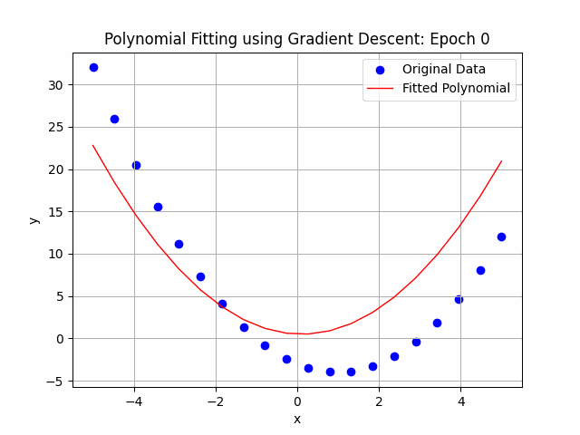 

**After the iteration completes**

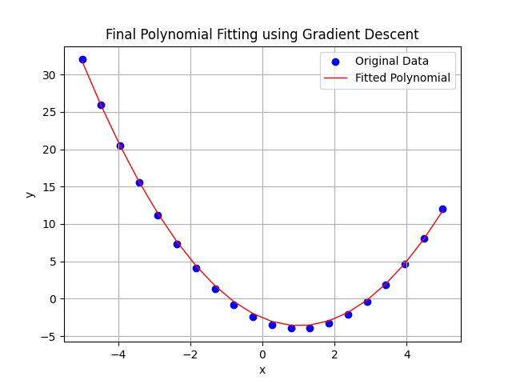 

**Training History**

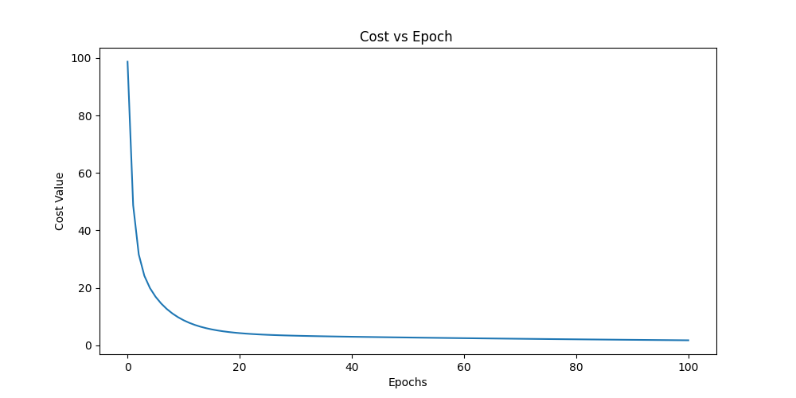


## Logistic Regression
Logistic regression estimates the probability of an event occurring, such as voted or didn’t vote, based on a given data set of independent variables.

### Sigmoid Function

The sigmoid function is an S-shaped curve that is used to classify a given sample into positive or negative classes and is defined by the expression : 
```math
 \sigma(x) = \frac{1}{1 + e^{-x}} 
```
 It predicts the probability of whether the given input features belong to a class or not. Higher the value, higher is the probability of belonging to that class. It is also known as the logistic function, $`\sigma(x)`$ maps every positive value of $`x`$ towards $`1`$, positive class, and every negative value of $x$ towards $`0`$, negative class. 

If we have certain threshold lets say $`\theta`$
We can easily predict the class as
```math
\hat{y} =
\begin{cases}
  1 & \text{if} & \mathcal{\hat{P}} \ge \theta \\
  0 & \text{if} & \mathcal{\hat{P}} < \theta
\end{cases}
``` 
### Logistic Cost function

As Sum of Squared error for logistic regression is non-convex and can't be optimized using gradient descent we use another cost function. 

 
The logistic regression model, $` h_w(x) `$, can be used to make a prediction as it estimates the probabilities.

```math
 \mathcal{\hat{P}} = h_w(x) = \sigma(w^Tx) 
```

 We now need to choose the parameters $w$ such that, the model $`h_w(x)`$ estimates high probabilities for positive class $`(y=1)`$ and low probabilities for negative class $`(y=0)`$. The following cost function captures this behavior of $`h_w(x)`$.

```math
\text{Cost}(h_w(x),y) =
\begin{cases}
  -\log (h_w(x)) & \text{if} & y = 1 \\
  -\log (1-h_w(x)) & \text{if} & y = 0
\end{cases}   
```

For positive class, this cost function will give a large value if the model estimates a probability close to $0$, as $`-\log(h_w(x)`$ increases when $h_w`(x)`$ approaches  $`0`$, similarly the cost will be very large if the model estimates a probability close to $`1`$ for the negative class. Likewise, when the model estimates a probability close to $`1`$ for positive class, the cost is close to $`0`$, and the cost is near $0$ for negative class when the model gives a probability close to $`0`$.

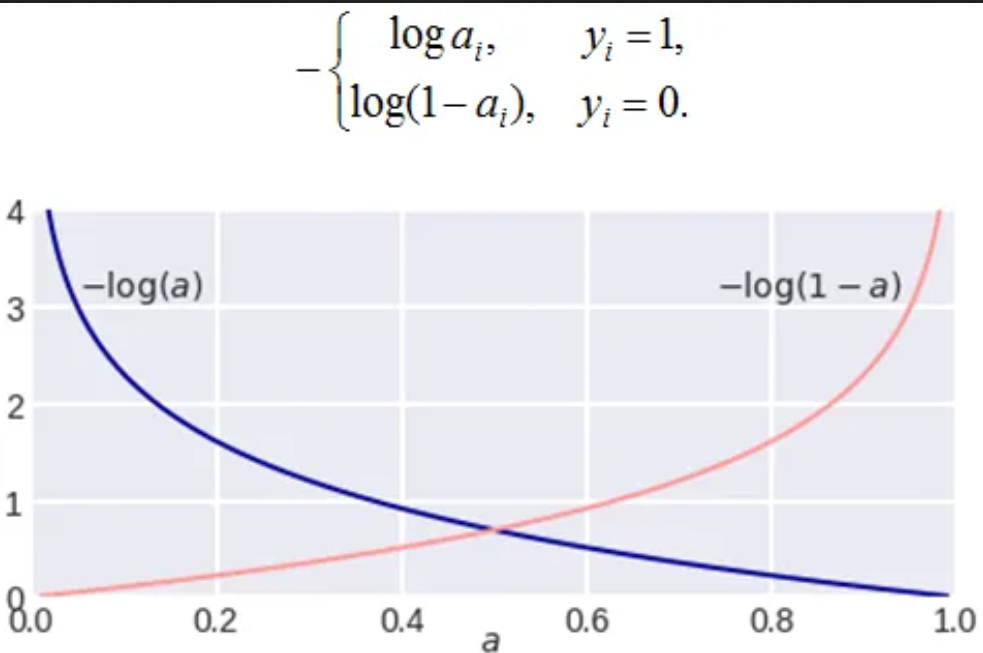

If $`y=1`$, the cost function is given as 
```math
\text{Cost}(h_w(x),y) = -\log (h_w(x))
```
From above diagram, we can observe that the $`\text{Cost}=0`$, at $`h_w(x) = 1`$, which is correctly classified as the positive class. For the wrong prediction, the cost becomes extremely large as shown by the red dotted line at $`h_w(x)=0`$.

Thus $`h_w(x)=0`$ is similar to predicting $`\mathcal{P}(y=1|x;w)=0`$:  the probability of positive class prediction $`(y=1)`$ given $`x`$ with $`w`$ parameters is zero.

Similarly, if $`y=0`$, the cost function is given as 
```math
\text{Cost}(h_w(x),y) = -\log (1- h_w(x))
```
and above plot shows $`\text{Cost}=0`$, at $`h_w(x) = 0`$, which is the correct prediction for the negative class. When the model predicts a positive class at $`(1-h_w(x)) = 1`$, the cost is extremely high. 

Alternatively, the cost function can be written in a single line as:
```math
 \text{Cost}(h_w(x), y) = -y\log(h_w(x)) - (1-y)\log(1-h_w(x))  
 ```

This equation is similar to above two equations and behaves in similar manner.
- If $`y=1`$, $`(1-y)`$ term will become zero, therefore $`-\log(h_w(x))`$ alone will be present.
- Similarly, if $`y=0`$, $`y`$ term will become zero, therefore only $`-\log(1-h_w(x))`$ will be present in the equation.
 

# Gradient Descent on Binary cross entropy

Let $`z = w_1 x_1 + w_2 x_2 + b`$ be our linear model, then let $` \hat{y} = a = \sigma(z)`$ be our logistic model.

Also, let $`\mathcal{J}(\hat{y}, y)`$ represent our log-loss function where $`\hat{y}`$ is the predicted class and $`y`$ is the actual class.


$$
\mathcal{J}(\hat{y}, y) = - y \log(a) - (1-y) \log(1-a) \quad \text{where} \; \hat{y} = a
$$

Taking the partial derivative with respect to \( w_1 \):

$$
\frac{\partial}{\partial w_1} \mathcal{J}(\hat{y}, y) =  \frac{\partial}{\partial w_1} \left[ - y \log(a) - (1-y) \log(1-a) \right]
$$

Using the chain rule:

$$
\frac{\partial \mathcal{J}}{\partial w_1}  =  \frac{\partial \mathcal{J}}{\partial a} \frac{\partial a}{\partial z} \frac{\partial z} {\partial w_1} 
$$

Now, figuring out the individual partial derivatives:

$$
\frac{\partial \mathcal{J}}{\partial a} = \frac{\partial}{\partial a} \left[ - y \log(a) - (1-y) \log(1-a) \right]
$$

$$
\frac{\partial \mathcal{J}}{\partial a} = -y \left( \frac{1}{a} \right) - (1-y) \left( \frac{-1}{1-a} \right) = \frac{a-y}{a(1-a)}
$$

Similarly,

$$
\frac{\partial a}{\partial z} = a(1-a)
$$

Putting it all together:

$$
\frac{\partial \mathcal{J}}{\partial w_1} = \frac{a-y}{a(1-a)} \cdot a(1-a) \cdot \frac{\partial z}{\partial w_1}
$$

Since \( z = w_1 x_1 + w_2 x_2 + \cdots + w_n x_n \), we have:

$$
\frac{\partial z}{\partial w_1} = x_1
$$

Therefore:

$$
\frac{\partial \mathcal{J}}{\partial w_1} = (a-y) x_1
$$

 
 
Lastly,
```math
\frac{\partial z} {\partial w_1} = \frac{\partial (w_1 x_1 + w_2 x_2 + b)}{\partial w_1} = x_1
```

Hence,

```math
\begin{align*}
\frac{\partial \mathcal{J}}{\partial w_1}  =  \frac{\partial \mathcal{J}}{\partial a} \frac{\partial a}{\partial z} \frac{\partial z} {\partial w_1} = \frac{a-y}{a(1-a)} a(1-a) x_1 = (a-y)x_1
\end{align*}
```
Now, we can update $`w_1`$ using gradient descent
```math
w_1 = w_1 -\alpha \frac{\partial \mathcal{J}}{\partial w_1}
```
 
Also for bias term
 
```math
\begin{align*}
\frac{\partial \mathcal{J}}{\partial b}  = (a-y)
\end{align*}
```
 

Similarly, for all parameters
```math
\begin{align*}
w_i &= w_i - \alpha  \frac{\partial \mathcal{J}}{\partial w_i} \tag{i represents feature or parameter} \\
b &= b - \alpha  \frac{\partial \mathcal{J}}{\partial b}
\end{align*}
```
For m examples, Binary cross entropy loss is given as

```math
 \mathcal{J}(w) =- \frac{1}{m} \sum_{i=1}^m y_i \log (\sigma(w^T x_i)) + (1-y_i) \log (1-\sigma(w^Tx_i) ) 
```
 

## Code Implementation Logistic Regression

### Gradient Descent logistic regression
```python
grad_w1,grad_w2,grad_b = 0.,0.,0.
    for i in range(0,X.shape[0]):
        y_hat = predict(X[i],parameters) 
        error = y_hat - Y[i]
        grad_w1 += error * X[i][0] # feature x1
        grad_w2 += error * X[i][1] # feature x2 
        grad_b += error 
    
    grad_w1 /= X.shape[0]
    grad_w2 /= X.shape[0]
    grad_b /= X.shape[0]
```

### binary cross entropy
```python
def binary_cross_entropy_loss (Y_hat, Y):
    return -(Y * np.log(Y_hat) + (1 - Y)* np.log(1 - Y_hat))
```


### **Sample bash command to run the logistic Regression script**  
 Please wait when the code is running due to `Animation` preparation

 ```bash
 python Polynomial_Regression/main.py --param 2,3,4 --epochs 200 --alpha 0.01
 ```

### Results Logistic Regression


 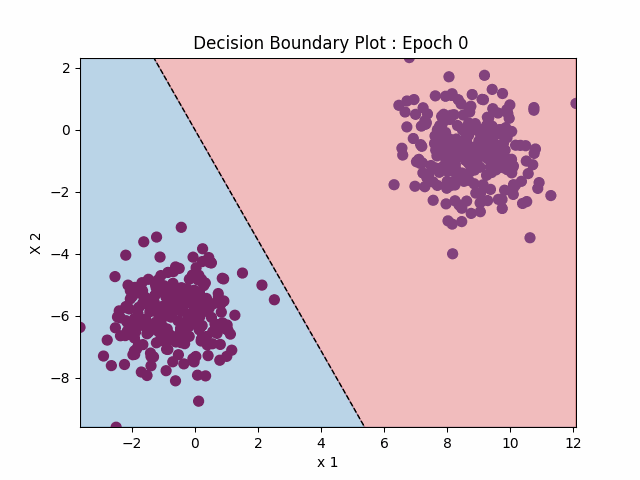

 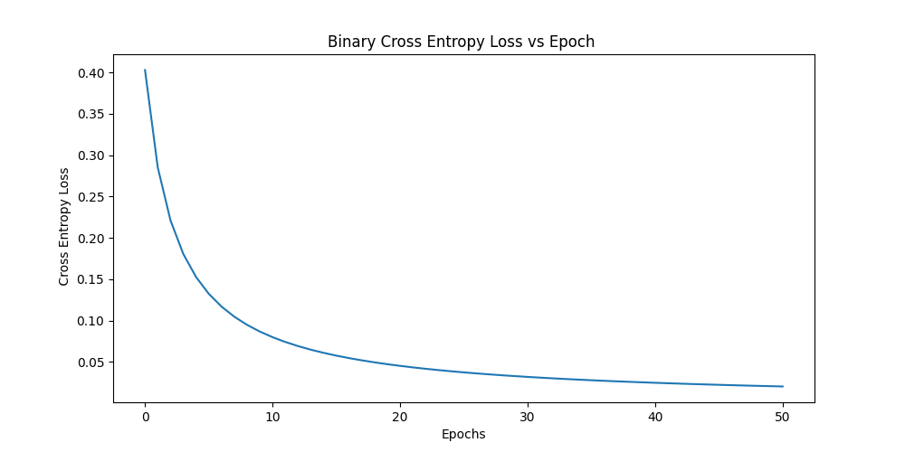

 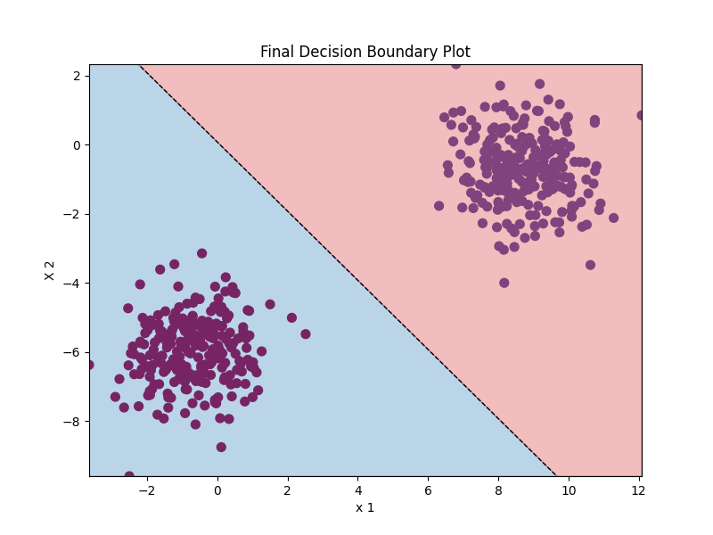

 ## Multinomial Logistic Regression

For this task, I have choosen the one vs rest approach in creating the multinomial logistic regression. Other approach include creating a simple neural network architecture and then output layer contains many nodes equal to the number of classes.

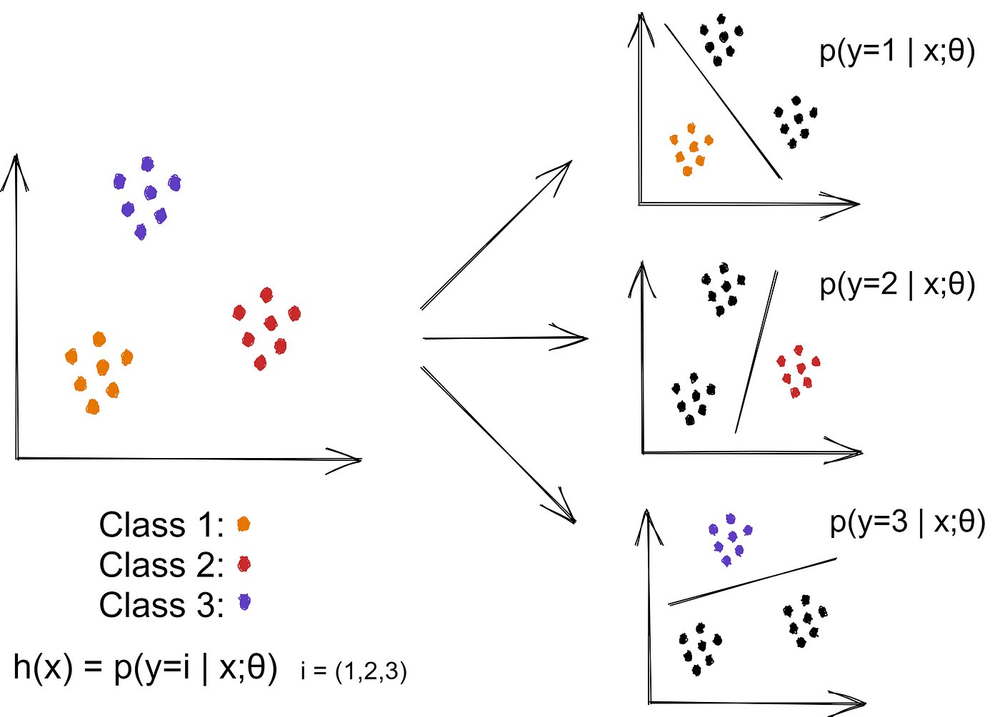

### Approach Explanation
If we have to classify data into N classification, then for each cluster or class we train a logistic regressor. So for N classes we train N logistic Regressor. Each logistic regressor gives probability of a data corresponding to a particular class and the class with highest probability will be choosen.

### Code Implementation Multinomial Logistic Regression

### **Predicting Class**

```python
def calc_output_array(self,x,parameter):
        '''
        Outputs the function value based on X a numpy array
        return a output numpy array
        '''
        w1,w2,b = parameter["w1"], parameter["w2"], parameter["b"] 
        return self.sigmoid(w1 * x[:,0] + w2 * x[:,1] + b)


    def predict_probability(self,X):
        probability = []
        for parameter in self.parameter_list:
            probability.append(self.calc_output_array(X,parameter))
        probability_array = np.dstack(probability)
        return probability_array
    

    def predict(self,X):
        probability_array = self.predict_probability(X)
        return np.argmax(probability_array, axis=2).flatten()
```

In the above code , using the trained parameter of each logistic regressor we predict the probability and the index of the array with highest probability which also corresponds to the class number is choosen.

### **Calculating Loss**
```python
def binary_cross_entropy_loss (self,Y_hat, Y):
        return -(Y * np.log(Y_hat) + (1 - Y)* np.log(1 - Y_hat))
    
def categorical_cross_entropy_loss (self,Y_hat_probability, Y_encoded):
    loss = self.binary_cross_entropy_loss(Y_hat_probability.flatten(),Y_encoded.flatten())
    loss = loss.flatten()
    return loss
```
We sum the the binary entropy loss of each logistic regressor for a dataset and take the average loss.


 ### **Sample bash command to run the Multiinomial script**  
 Please wait when the code is running due to `Animation` preparation

 ```bash
python Multinomial_Classification/main.py  --epochs 100 --alpha 0.01 --clusters 4
 ```

### Results Multinomial Regression

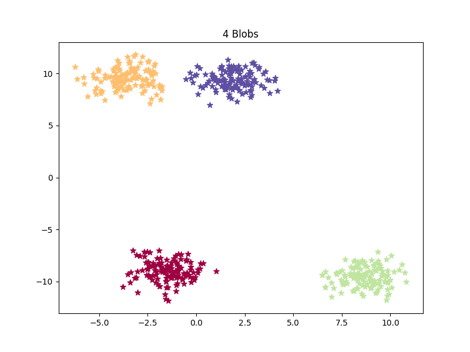

This is the randomly generated blob. Now we train the multinomial logistic regression.

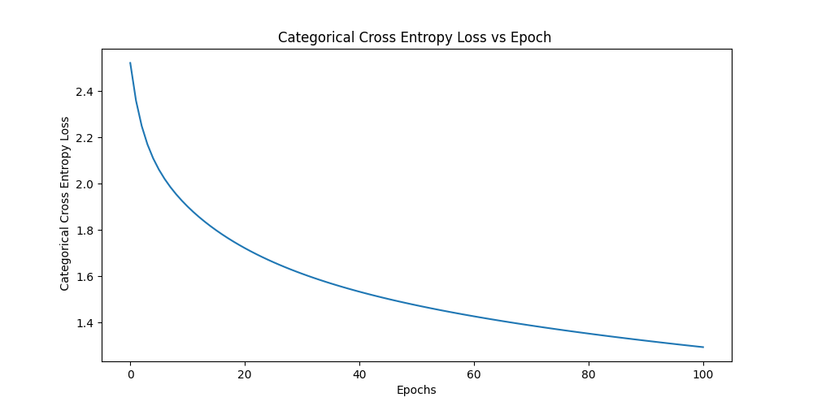
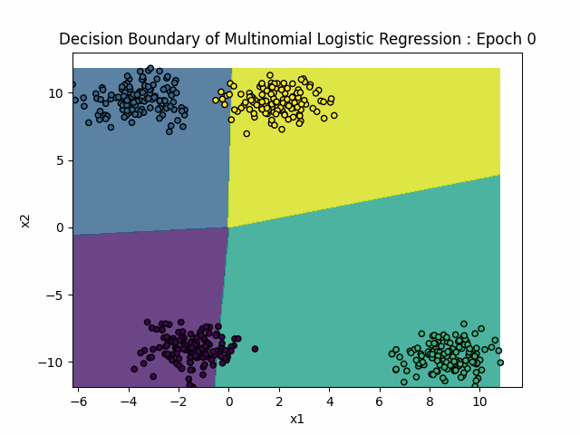

 

 
